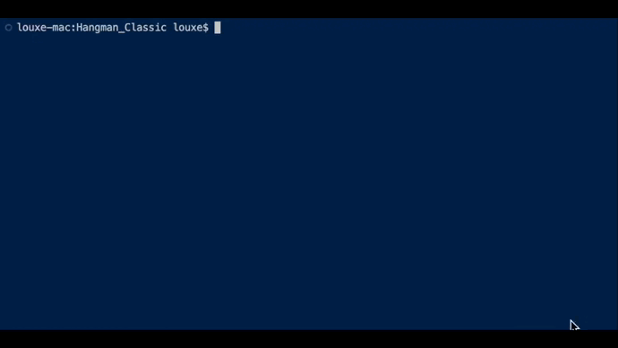

*Welcome to the Hangman Classic Manual*

## Launch the application ##

If it's your first time starting the application, and you have build the app (if not, refer to the [README.md](README.md) and go to the install and build section),
you just need to execute the excecutable file in the bin folder.

```
./bin/executable_name
```


Good job ! You are now in the game's main menu, let's start !

## Start a game ##

Now let's start a new game, everytime the program asks you for an input, you'll see the invite :
```
Choose: 
``` 

The options to enter are indicated like this:
```
[inpout]Name off the option
```
Here we want to launch a new game so press "s" then "enter'.

Then choose all the options that you want, and let's get started !


## Let's play ! ##

As you can see, at the begining of the game, you have 10 attempts remaining before you loose the game.
The number of attempt will decrease each time you enter a wrong letter.
When it reachs 0, you loose the game.
The only way to win is to find the word.

At the endgame, a menu is displayed to ask you if you want to continue, go back and change the options, or exit the game.